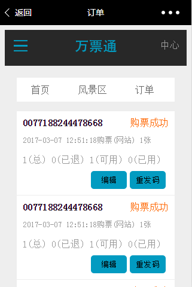
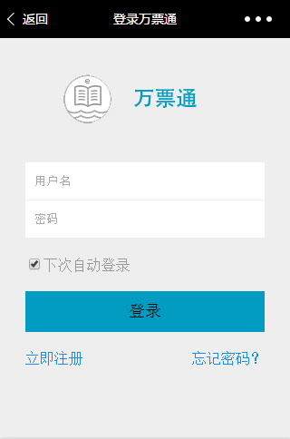
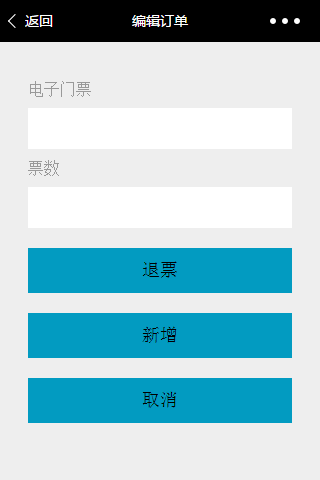

#Scene(static page model designed by myself)

# Description
### Front-end web
html/css/js/jquery
### Introduction
The core of this project is to design the page of web by myself instead of imitative writing.The project include the home page,scenic spot page,scene details page,order management page,login page,register page and so on according to the relevant design specifications.Of course,images in the detail page can not reflect the corresponding theme because it is just a placeholder.

# Preview

 w_order page

 w_scene page

 w_login page

 w_message page

 w_edit page

